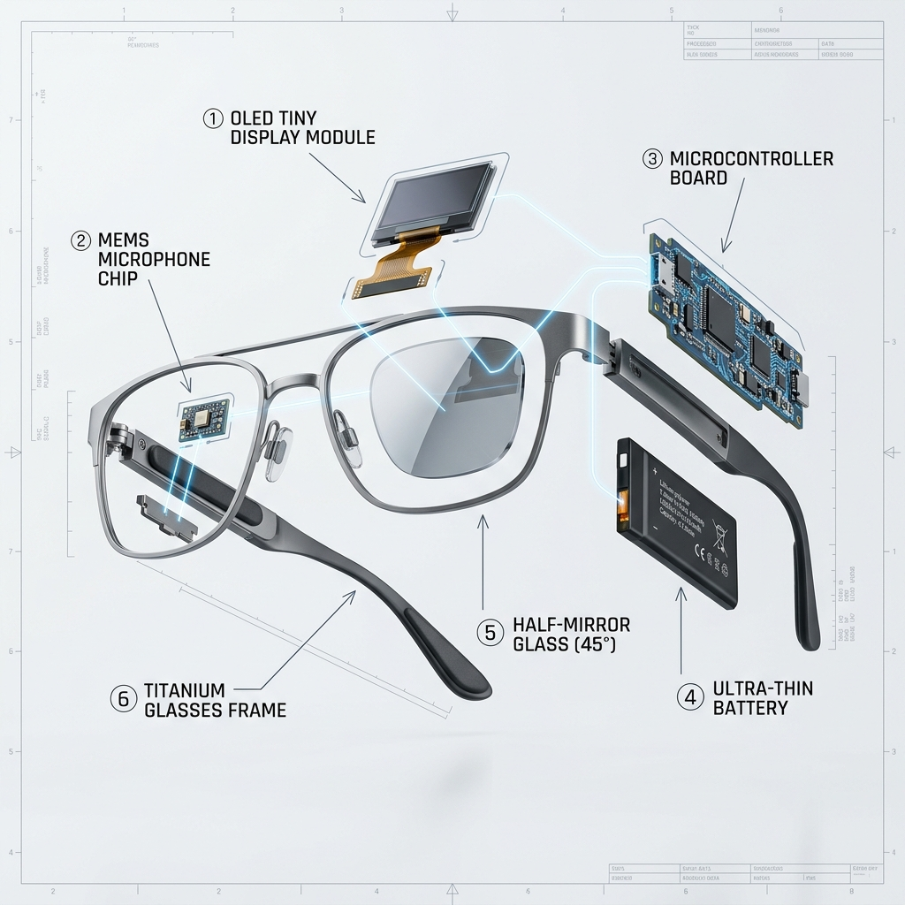
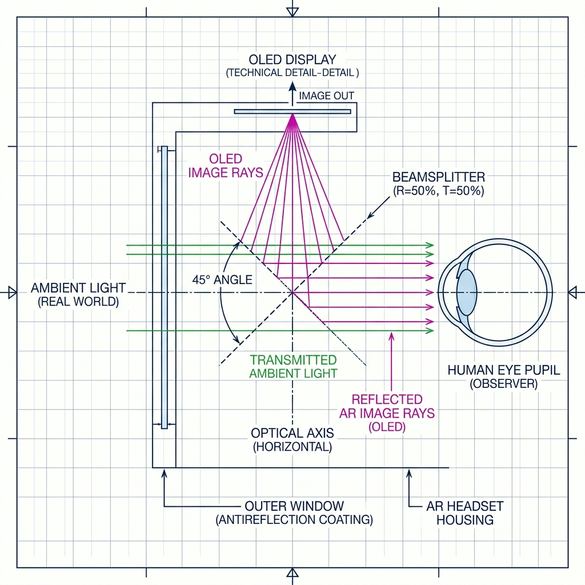
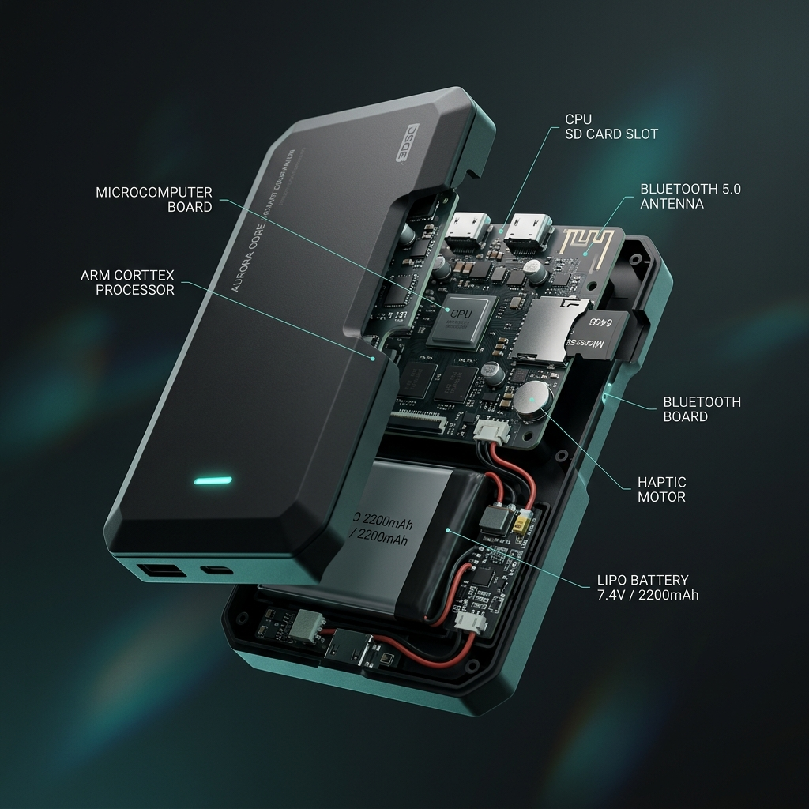
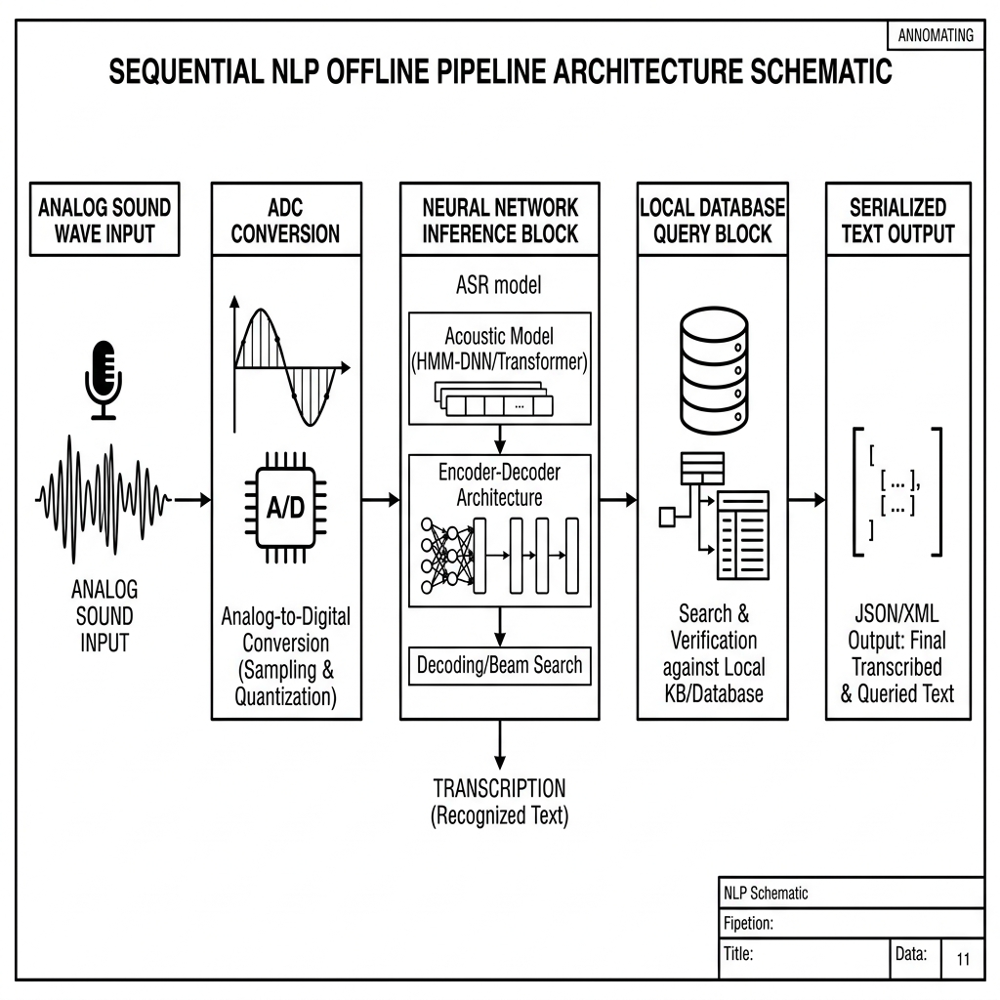
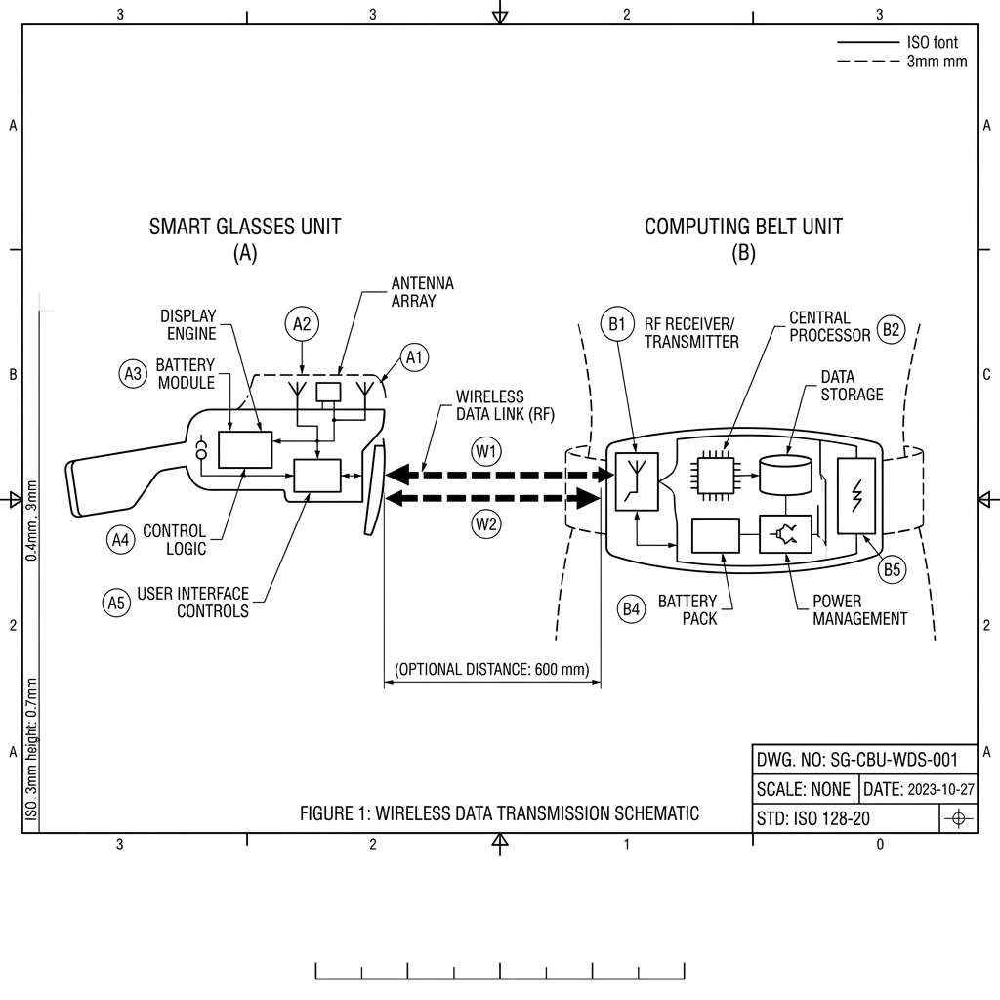

# NOUR - Smart Knowledge Glasses
### Advanced Offline Augmented Reality System

_Cognitive Processing via Edge Computing_

---

## 1. Abstract and Architectural Vision

The **NOUR** project introduces a paradigm shift in wearable, augmented-reality knowledge retrieval. By circumventing the traditional dependence on continuous cloud connectivity—a common bottleneck for real-time natural language processing (NLP)—this system shifts the heavy computational loads to a localized edge computing infrastructure. 

Drawing upon principles from acoustics, micro-optics, and decentralized computing architectures, NOUR captures acoustic waveforms (specifically Arabic speech patterns), processes them entirely offline within fractions of a second, and projects the corresponding text onto a transparent visual plane, merging digital data seamlessly with the user's natural environment.

At the software level, the intelligence core is engineered in **Python**, where the speech pipeline, NLP orchestration, and knowledge retrieval logic are coordinated as a unified offline stack. This enables fast iteration, deterministic local execution, and maintainable deployment on edge hardware such as Raspberry Pi.

Beyond being a prototype, NOUR is positioned as a practical assistive computing platform: portable, privacy-preserving, and resilient in low-connectivity environments. The architecture demonstrates how advanced Arabic voice understanding can be transformed into immediate visual guidance for education, accessibility, and high-focus learning scenarios.

---

## 2. The Optical and Acoustic Subsystem (The Headset Mechanism)

Developing a lightweight headset was critical for achieving widespread usability. The engineering approach rejected standard, cumbersome AR headsets in favor of a decentralized strategy, strictly confining the headset's components to data collection (acoustic input) and data dissemination (optical output).

  
   
  <i>Figure 1. Exploded view illustrating the integration of micro-components within the titanium frame.</i>

### 2.1 Optical Mirroring Mechanism
The fundamental optical problem—how to project a digital interface into the eye without obstructing the forward view—was resolved using a **Half-Mirror Beamsplitter**. 
* **The Projector**: A highly luminous **0.96-inch OLED micro-display** is positioned at the top-right apex of the frame, facing downwards.
* **The Reflector**: A specialized semi-reflective glass substrate is precisely angled at 45 degrees below the OLED module.
* **The Result**: The OLED emits high-contrast text downward. The 45-degree angle of the beamsplitter reflects 50% of the light outward towards the pupil, while permitting 50% of ambient environmental light to pass through. This yields a focal length illusion where the text appears to float over the physical surroundings.

  
   
  <i>Figure 1a. Strict 2D geometrical schematic representing the 45-degree optical reflection vector.</i>

### 2.2 Isochronous Acoustic Capture
For accurate NLP inference, capturing a high signal-to-noise ratio is paramount. The system utilizes an **INMP441 MEMS Microphone** embedded securely within the chassis. Operating on the I2S (Inter-IC Sound) digital bus standard, the 24-bit sensor guarantees high-fidelity, high-dynamic-range sampling of spoken linguistic markers, preconditioning the data before it enters the translation pipeline.

---

## 3. Hardware Specifications Matrix

To achieve the theoretical models discussed, the following components were utilized to construct the operational prototype:

| Component Designator | Technical Specifications | Functional Role in Architecture |
| :------------------- | :----------------------- | :------------------------------ |
| **Raspberry Pi 4 Model B** | 2GB LPDDR4 RAM, Quad-Core Cortex-A72 | Serves as the primary Edge Computing node; executes NLP, Speech-to-Text inferences, and JSON dataset indexing offline. |
| **ESP32-C3 Mini Module** | 32-bit RISC-V core, Bluetooth 5.0 LE | Functions as the localized telemetry unit on the headset to stream I2S audio and receive serialized display vectors. |
| **INMP441 Audio Sensor** | MEMS, Omnidirectional, 61 dBA SNR | Captures acoustic environments and transforms analog pressure waves into serialized digital I2S inputs. |
| **Monochrome OLED Panel** | 0.96 inch, 128x64 pixels, I2C Bus | Delivers the high-contrast photonic output necessary for viable reflection onto the half-mirror. |
| **Optical Half-Mirror** | 50/50 Reflective/Transmissive | Superimposes the OLED photonic stream with ambient light photons. |
| **Dual Power Infrastructure** | 5000mAh (Belt Unit) / 150mAh (Headset) | Ensures distributed and decoupled power delivery maximizing the operational lifespan to approximately 6 hours. |

---

## 4. The Edge Processing Core (The Computing Unit)

The crux of the NOUR architecture lies in its offloading mechanism. To preserve the ultra-lightweight form factor of the headset, complex tensor calculations are outsourced to an independent "Belt Unit" which houses the computational node.

  
   
  <i>Figure 2. Cutaway render of the decentralized Edge Computing Belt Unit.</i>

### 4.1 Localized Knowledge Inference
Inside this secure chassis resides the Raspberry Pi micro-computer. Upon booting, it loads a highly compressed, language-specific Whisper neural model into RAM. 
When raw digital audio is ingested via Bluetooth, the following sequence triggers entirely offline:
1. **Phonetic Recognition**: The neural network deciphers the Arabic audio morphology and converts it into a structural text string.
2. **Deterministic Lookup**: The generated text is passed through a deterministic parsing layer, querying a massive local JSON database (containing encyclopedic or scriptural texts).
3. **Response Assembly**: Upon a successful string match or heuristic approximation, a concise response packet is compiled for transmission.

  
   
  <i>Figure 2a. Sequential software architecture diagram depicting the analog-to-text inference node.</i>

---

## 5. Wireless Telemetry and Latency Reduction

An innovative approach to communication protocols was required to minimize the latency between spoken word and optical rendering. Standard commercial Bluetooth implementations often introduce buffering delays unacceptable in real-time interfaces.

  
   
  <i>Figure 3. 2D Architectural schematic demonstrating the strictly defined telemetry cycle and dual-channel wireless coupling.</i>

### 5.1 The Duplex Telemetry Cycle
The established connection acts as an asymmetric duplex pathway:
- **Uplink (Headset to Core)**: A continuous stream of lossless raw audio data is pumped via an optimized Bluetooth RFCOMM socket. The ESP32 acts solely as a pass-through intermediary, bypassing any local audio filtering to reduce cycle overhead.
- **Processing Window**: The Pi computes the data in predefined micro-batch intervals (e.g., 3-5 seconds acoustic windows).
- **Downlink (Core to Headset)**: Reconstructed lightweight text vectors are transmitted back to the ESP32 via a synchronized interrupt routine. The ESP32 instantly translates these bytes into I2C commands, rendering the characters sequentially on the OLED display line by line.

This rigorous cyclic approach ensures a deterministic state machine, yielding a robust, near-zero latency phenomenon highly akin to instantaneous organic recall.

---

 
 

  <h3>The Practical Catalyst</h3>

  
<b>وَمَن يَتَّقِ اللَّهَ يَجْعَل لَّهُ مَخْرَجًا</b>

  <i>"بس انا بعملها عشان اغش فى امتحان القرآن"</i> 
  طالب ازهري والحالة صعبة

